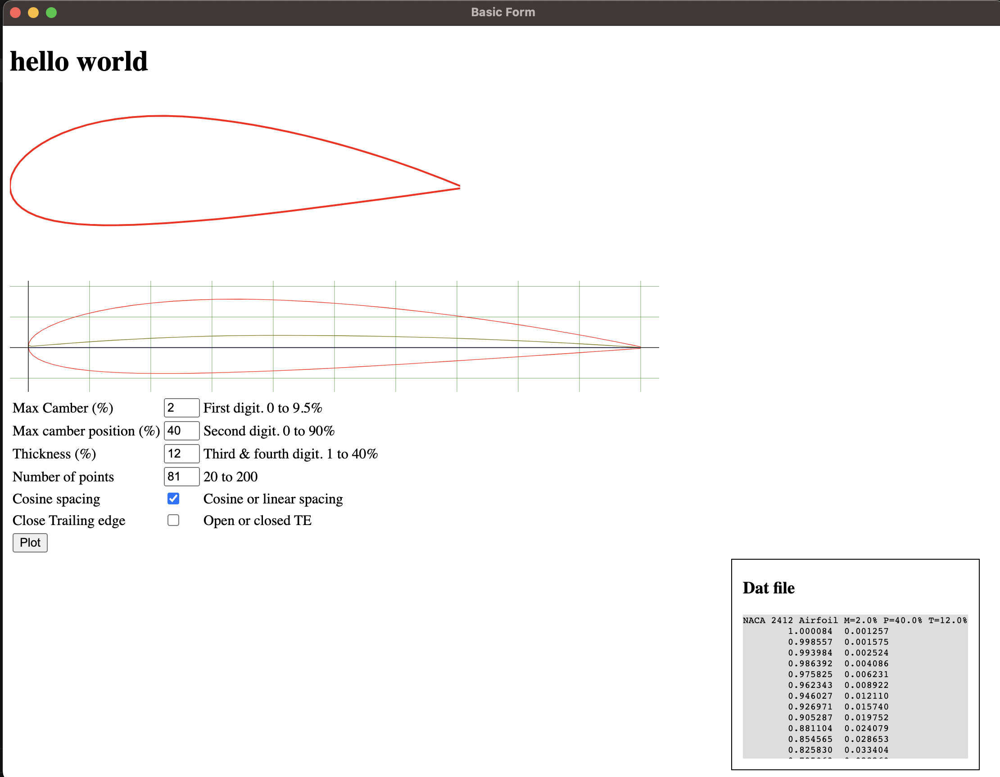

## To setup the repo locally follow the following steps:

### Clone the repo:

```
https://github.com/developedbysaad/airfoil-app.git
```

### Install dependencies

```
npm install
```

### To run the application

```
npm run dev
```

### To exit the application

```
control + C
```
